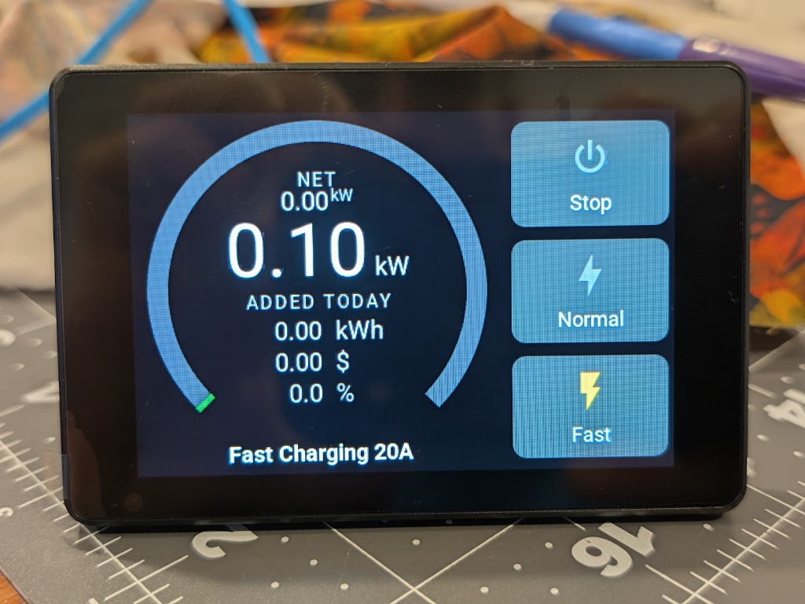
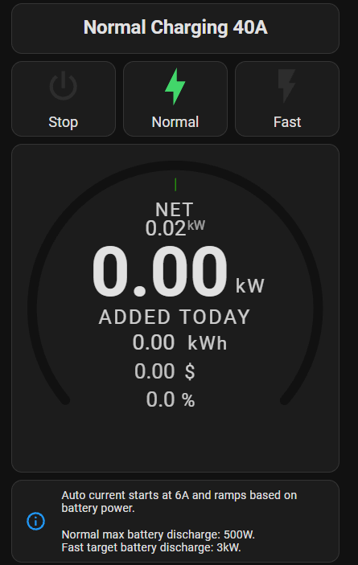

# esphome-evse
EVSE running entirely on ESP32 MCU ESPHome YAML

BETA firmware. Use at your own risk.
- No RCD.
- The S3 package includes PV auto charge (Normal / Fast), a low-voltage lockout, and the local LCD.
- Home Assistant supplies the battery power, voltage, and state-of-charge sensors those modes use.

A device config sets the name, Wi-Fi, API and OTA credentials, and the substitutions below. Everything else is pulled from this repo:

- `components/evse_cp` is the control-pilot state machine (external component).
- `packages/s3-evse.yaml` is the ESP32-S3 board, sensors, charge logic, and LCD.

`esphome-evse.yaml` is a starting device config. Point `packages:` at this repo:

```yaml
packages:
  s3_evse:
    url: https://github.com/clowrey/esphome-evse.git
    ref: main
    files:
      - packages/s3-evse.yaml
    refresh: 0s
```

`secrets.yaml` needs `wifi_ssid`, `wifi_password`, `ota_password`, and `api_encryption_key`. Set `wifi.use_address` when OTA should target an IP the device already has.

The package uses these defaults when a device file leaves a substitution out. Values marked first-boot are used once; later changes are saved on the device.

- `name` — hostname, for example `evse-0`. Entity ids use it with the hyphen turned into an underscore (`sensor.evse_0_power`). Leave this as `evse-0`, `evse-1`, and so on if you will have more than one EVSE. You can rename the device in Home Assistant afterward; that does not change the entity ids. Changing `name` in the YAML makes Home Assistant see a new device.
- `device_description` — ESPHome device comment.
- `ha_battery_power_id` — house battery power entity, signed watts: positive is charging the house battery, negative is discharging. Normal and Fast modes step the charge current from this sensor.
- `ha_battery_voltage_id` — house battery voltage entity. Charging locks out after 30 seconds at or below the cutoff (47 V unless changed on the device).
- `ha_battery_soc_id` — house battery state of charge, percent. Charge current is reduced as SOC falls toward the minimum target.
- `current_cal_0` .. `current_cal_4` — CT clamp calibration, `raw reading -> amps`.
- `max_current_initial` — first-boot Max Current Limit, amps. This is the ceiling. Current Setpoint is what the car is offered, and Normal and Fast step that setpoint between 6 A and this limit. 6 A is the floor because 5 A showed up as 0 A on a Leaf. After first boot, change Max Current Limit on the device.
- `normal_setpoint_a` — LCD Normal button only. It selects Normal and sets Current Setpoint to this many amps, which is the floor the ramp starts from. Auto then raises it when the house battery is charging and lowers it when discharge passes the Normal target. The Home Assistant Normal button changes mode only.
- `fast_setpoint_a` — LCD Fast button only. It selects Fast and jumps Current Setpoint to this many amps. Auto then moves it to hold house-battery discharge near the Fast target, still between 6 A and Max Current Limit. If it is already at 6 A and the battery keeps discharging, Fast pauses. The Home Assistant Fast button changes mode only.
- `electricity_cost_initial` — first-boot electricity price, USD per kWh, for the daily cost on the LCD.
- `car_battery_kwh_initial` — first-boot car battery size, kWh. Daily energy is also shown as a percent of this.

`dashboard-evse.yaml` is a Home Assistant dashboard for `name: evse-0`. It uses those entity ids (`sensor.evse_0_power`, `number.evse_0_charger_mode`, and the other `evse_0_` entities). It needs the flex-horseshoe-card and Mushroom cards from HACS. If you change `name`, change the `evse_0_` prefix to match.

LCD



Home Assistant dashboard



[Post in the ESPHome Discord "Show Off" Channel](https://discord.com/channels/429907082951524364/1308643575449518160) 


[Inspired by this great ESP32 (not ESPHome) project!](https://github.com/dzurikmiroslav/esp32-evse) 

[Miroslav Dzúrik explains the CP protocol and hardware to generate it in depth on his Wiki here.](https://github.com/dzurikmiroslav/esp32-evse/wiki/CP-calibration)


Charging real car at 40A - current setpoint can be changed in real time and vehicle will adjust its draw.


PCB Designed by me - produced by JLCPCB


